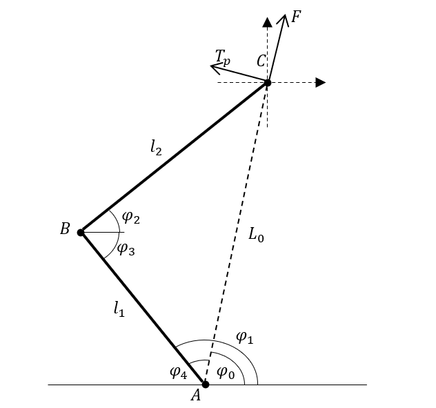

# 2连杆分析

参考：[五连杆运动学解算与VMC](https://zhuanlan.zhihu.com/p/613007726)

## 1 正运动学解算

$\phi_1$和$\phi_2$可由电机编码器测量得到。

$C$点坐标：

$$
\left \{
    \begin{array}{l}
        x_C = l_1\cos\phi_1 + l_2\cos\phi_2\\
        y_C = l_1\sin\phi_1 + l_2\sin\phi_2
    \end{array}
\right .
$$

得：

$$
\left \{
    \begin{array}{l}
        L0 = \sqrt{x_C^2 + y_C^2} \\
        \phi_0 = \arctan{\frac{y_C}{x_C}}
    \end{array}
\right .
$$

## 2 逆运动学解算

由余弦定理易得：

$$
\phi_2+\phi_3 = \arccos\frac{l_1^2+l_2^2-L_0^2}{2l_1l_2}
$$

又：

$$
\phi_3 = \pi - \phi_1
$$

得：

$$
\phi_2 = \arccos\frac{l_1^2+l_2^2-L_0^2}{2l_1l_2}+\phi_1-\pi
$$

## 3 雅可比矩阵

<!-- $$
\left [
    \begin{matrix}
        \dot L0 \\
        \dot \phi_0
    \end{matrix}
\right ]

 =

J
\left [
    \begin{matrix}
        \dot\phi_1 \\
        \dot\phi_2
    \end{matrix}
\right ]
$$ -->

基于文中描述可得：

$$
\left \{
    \begin{array}{l}
        \dot x_C = -l_1\dot\phi_1\sin\phi_1 - l_2\dot\phi_2\sin\phi_2\\
        \dot y_C = l_1\dot\phi_1\cos\phi_1 + l_2\dot\phi_2\cos\phi_2
    \end{array}
\right .
$$

即：

$$
\left [
    \begin{matrix}
        \dot x_C \\
        \dot y_C
    \end{matrix}
\right ]

 =
\left [
    \begin{matrix}
        -l_1\sin\phi_1 & -l_2\sin\phi_2 \\
         l_1\cos\phi_1 &  l_2\cos\phi_2
    \end{matrix}
\right ]

\left [
    \begin{matrix}
        \dot\phi_1 \\
        \dot\phi_2
    \end{matrix}
\right ]
$$

记作：

$$
\left [
    \begin{matrix}
        \dot x_C \\
        \dot y_C
    \end{matrix}
\right ]

 =
J_0

\left [
    \begin{matrix}
        \dot\phi_1 \\
        \dot\phi_2
    \end{matrix}
\right ]
$$

下面操作与文中相同，可得：

$$
J^T = J_0^TRM =
\left[
    \begin{matrix}
        l_1 \,\sin \left(\phi_0 -\phi_1 \right) & \frac{l_1 \,\cos \left(\phi_0 -\phi_1 \right)}{L_0 }\\
        l_2 \,\sin \left(\phi_0 -\phi_2 \right) & \frac{l_2 \,\cos \left(\phi_0 -\phi_2 \right)}{L_0 }
    \end{matrix}
\right]
$$

即：

$$
J =
\left[
    \begin{matrix}
        l_1 \,\sin \left(\phi_0 -\phi_1 \right) & l_2 \,\sin \left(\phi_0 -\phi_2 \right)\\
        \frac{l_1 \,\cos \left(\phi_0 -\phi_1 \right)}{L_0 } & \frac{l_2 \,\cos \left(\phi_0 -\phi_2 \right)}{L_0 }
    \end{matrix}
\right]
$$
