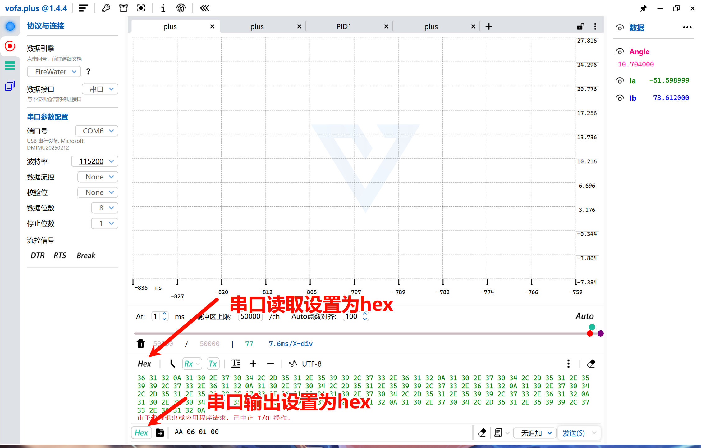
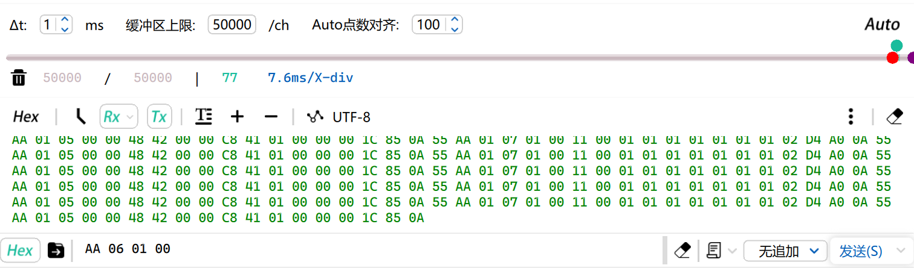
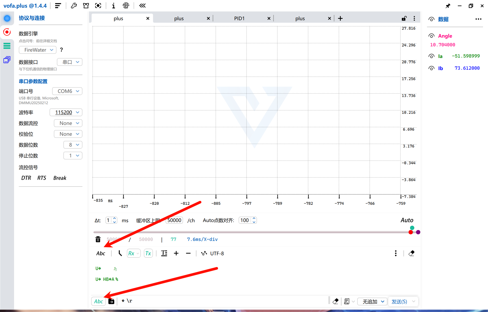
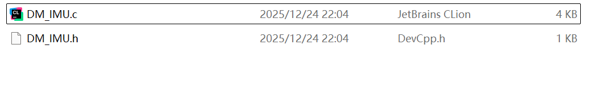
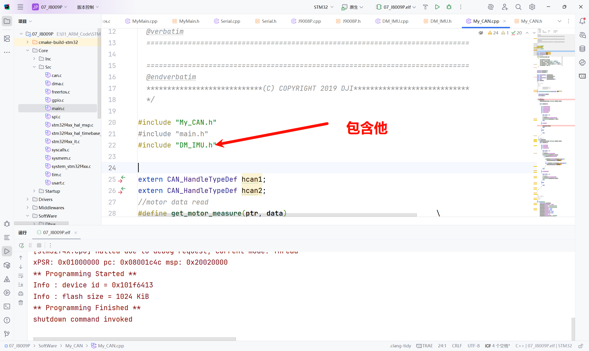
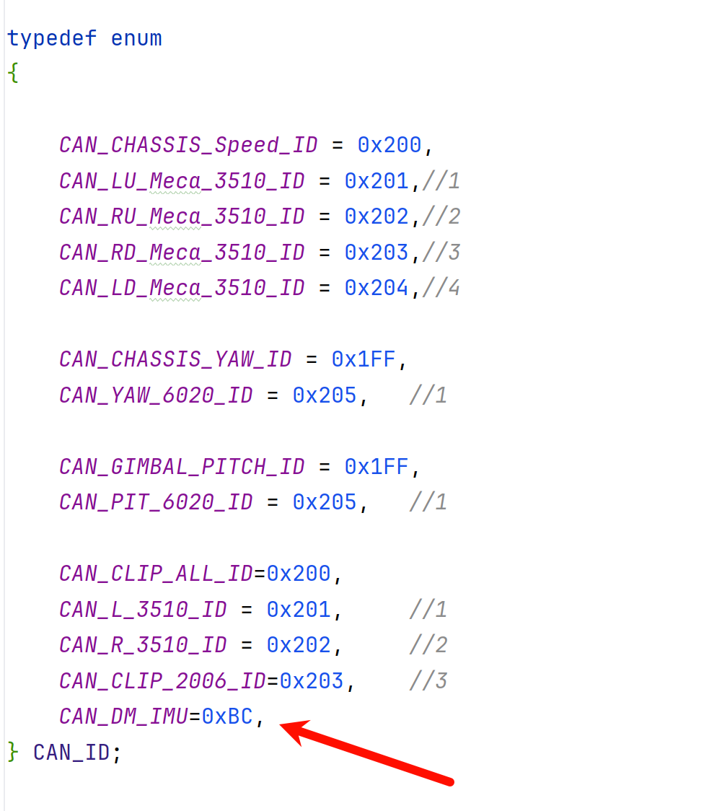
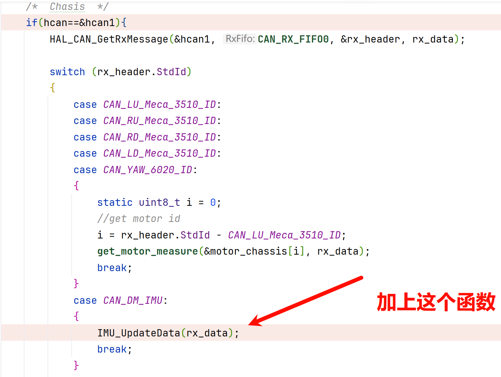
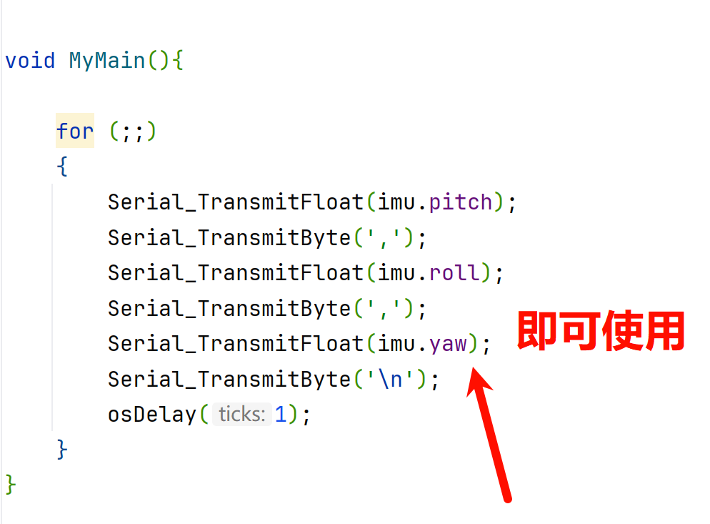

# A 通信设置

使用VOFA设置，设置为hex输出模式

## A.1 进入设置模式
```
AA 06 01 0D
```
发送成功后，串口读取部分会变为慢速输出数据



## A.2 设置为CAN输出模式
```
AA 0A 02 0D
```


## A.3 设置CANID
```
AA 08 X 0D
```
- X:是你想控制这个imu时的目标can id


## A.4 设置MSTID
```
AA 09 X 0D
```
- X:是你想让这个imu反馈时的can id


## A.5 开启CAN自动上报
```
AA 01 18 0D
```

## A.6 保存参数
```
AA 03 01 0D
```


## A.7 退出设置模式
```
AA 06 00 0D
```


## A.8 最后把串口读取和输出改回ascii



# B 代码设置
## B.1 包含这两个文件

## B.2 在大疆can通信中包含此文件




## B.3 枚举类型中添加imu的mst id 


## B.4 在can中断回调函数加上此函数



## B.5 最后就可以使用了(记得包含头文件)

