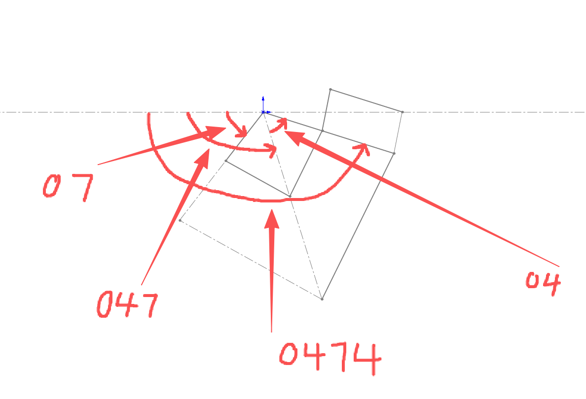
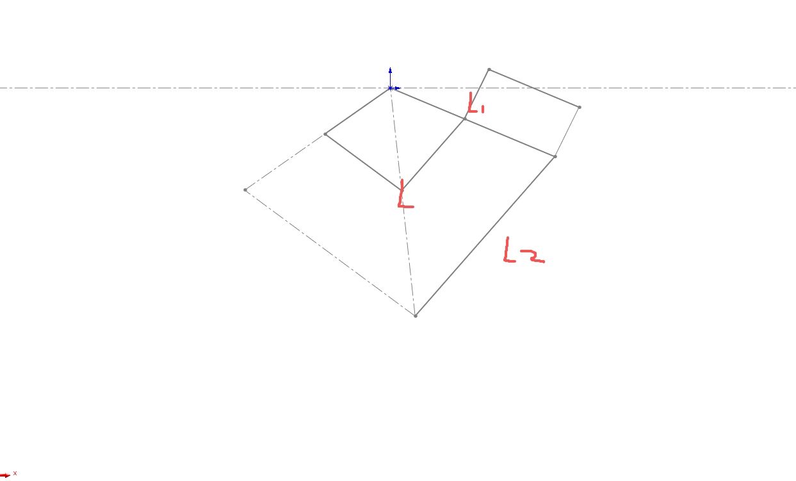
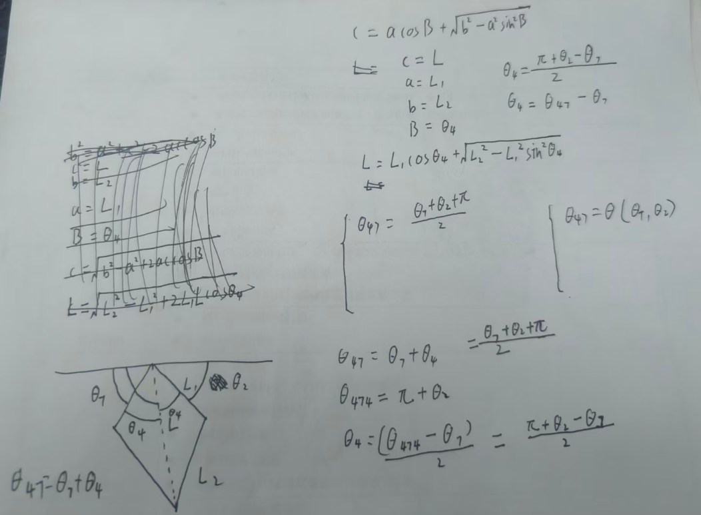
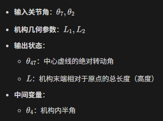

# 运动学解算

## 夹角定义

## 连杆长度定义

## 正向运动学解算

### 中心线角度方程

$$
\theta_{47}=\frac{\theta_{7}+\theta_{2}+\pi}{2}
$$

### 机构半角方程

$$
\theta_{4} = \frac{\pi + \theta_{2} - \theta_{7}}{2}
$$

### 长度（高度）方程

$$
L = L_{1} \cos\theta_{4} + \sqrt{L_{2}^{2} - L_{1}^{2} \sin^{2}\theta_{4}}
$$

